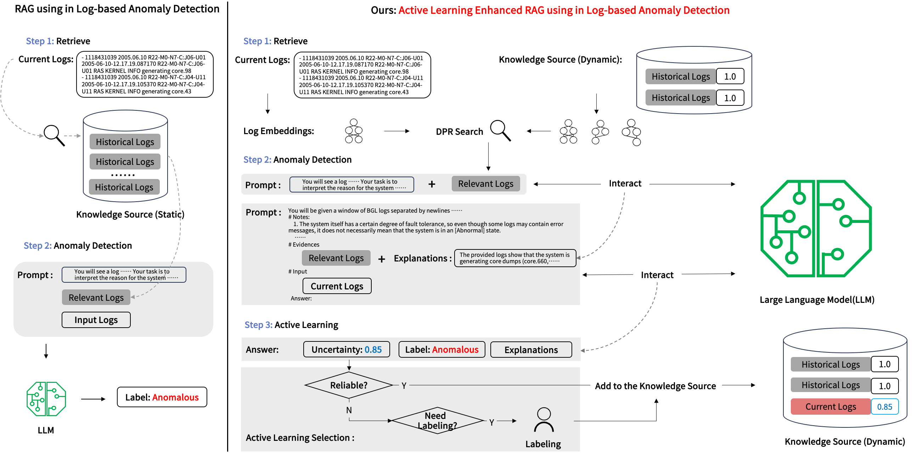

# EagerLog
EagerLog is a log-based anomaly detection method via active learning enhanced retrieval augmented generation.
## overview

On the one hand, EagerLog employs active learning to take an inspection of the logs adding to knowledge source, thus preventing the knowledge source from being contaminated by noise. On the other hand, EagerLog utilizes a dynamically expanding knowledge source, capable of promptly capturing changes in the software system, thus ensuring that the knowledge source remains up-to-date. Our experiments on three open datasets (BGL, Thunderbird, Zookeeper) and one industrial dataset demonstrate that EagerLog can achieve 93.65% F1 score with only around 10 labels, surpassing existing methods by 35.89%.

## Start
To begin EagerLog on BGL, run this code:
```shell
export QWEN_KEY=[Your QEWN key]
python main.py --config BGL.yaml
```
The key for qwen can be found on the qwen [official website](https://www.alibabacloud.com/en/solutions/generative-ai/qwen?_p_lc=1), and qwen-plus is recommended for use.


### Tips
This code utilizes the qwen API format and does not return log probabilities for uncertainty calculation. Here, we design prompts that require LLMs to actively express their uncertainty about the results. Alternatively, you can deploy the qwen model locally and use the log probabilities returned by the model, along with the formulas provided in the article, to calculate uncertainty.

### Requirements
```text
dashscope==1.14.1
numpy==1.26.4
pandas==2.2.2
PyYAML==6.0.1
scikit_learn==1.3.0
torch==2.1.2
tqdm==4.65.0
transformers==4.37.1
```

### Dataset
Our three open-source datasets can be found in [LogHub](https://github.com/logpai/loghub), and can be downloaded by directly running the code.

### config

Our configuration files are located in the ./config directory, and you can modify the contents there to perform experiments with different datasets and parameters.